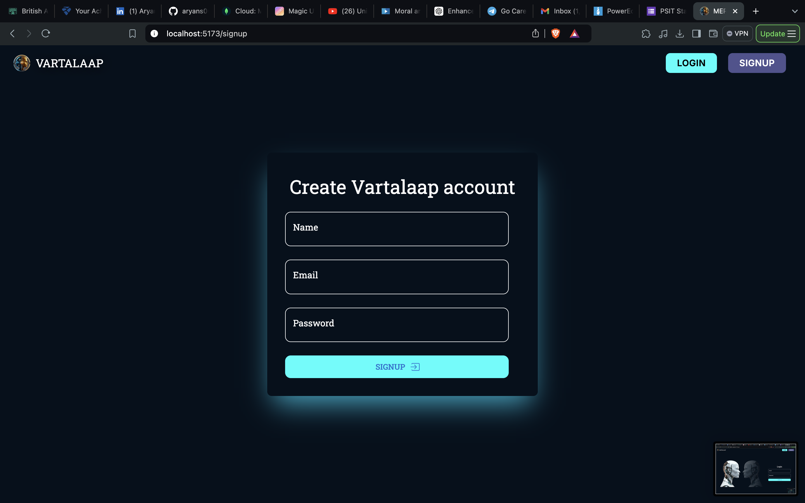
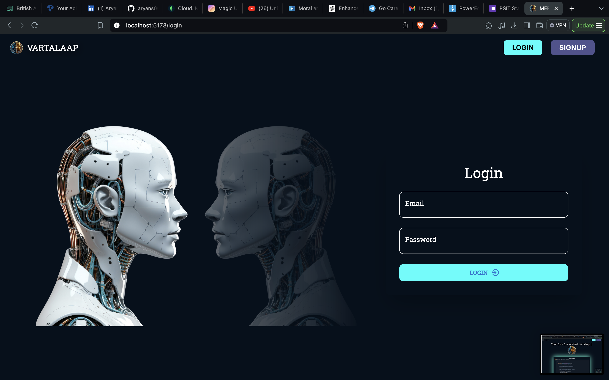

# VARTALAAP AI Chatbot Web Application

VARTALAAP is an intelligent AI chatbot web application built using the **MERN (MongoDB, Express.js, React, Node.js)** stack.  
This application leverages the power of **OpenAI's API** to provide meaningful and interactive conversations with users.  
The project focuses on creating a seamless user experience while incorporating essential features like authentication, security, and real-time interaction.

---

## ✨ Features
- 🤖 Interactive AI chatbot powered by **OpenAI**  
- 🔐 User authentication and authorization using **JWT**  
- 🔑 Secure password storage using **bcrypt**  
- 📱 Responsive design for mobile and desktop  
- 🔔 Toast notifications for improved user experience  

---

## 🛠 Tech Stack
**Frontend:** React, Material-UI, React Three Fiber, Axios  
**Backend:** Node.js, Express.js, MongoDB, OpenAI API  
**Database:** MongoDB  
**Authentication:** JSON Web Tokens (JWT), bcrypt  

---

## 📦 Prerequisites
Before you begin, ensure you have the following installed:

- [Node.js](https://nodejs.org/) (v14.x or later)  
- npm or yarn  
- [MongoDB](https://www.mongodb.com/) (local or cloud-based)  

---

## ⚙️ Environment Variables
Create a `.env` file in the root of your project and add the following:

```env
PORT=8080
MONGO_URI=your_mongodb_connection_string
JWT_SECRET=your_jwt_secret_key
OPENAI_API_KEY=your_openai_api_key






# For backend
cd backend
npm install
npm start

# For frontend
cd frontend
npm install
npm run dev
